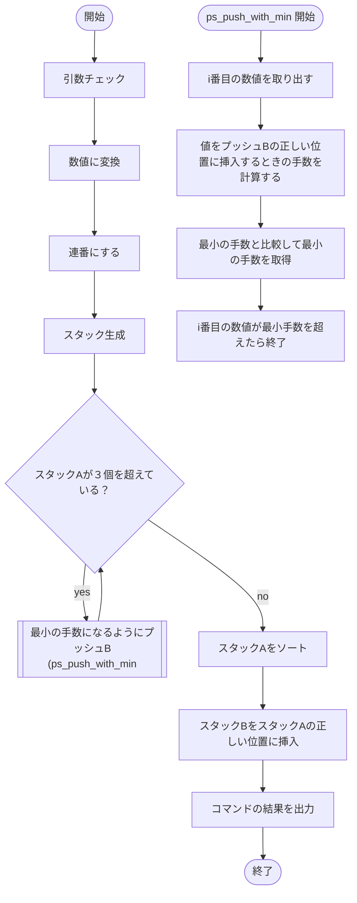

# 設計

## フロー

## 一覧

### データ構造

* [t_push_swap](#t_push_swap)
* [t_ps_stack](#t_ps_stack)
* [t_ps_list](#t_ps_list)
* [t_ps_cmdlst](#t_ps_cmdlst)

### 関数

* ロジック系
	* turk_sort [ps_turk_sort](#ps_turk_sort)
	* 出力系
		* コマンドを出力 [ps_print_cmdlst](#ps_print_cmdlst)
		* エラーを出力 [ps_print_error](#ps_print_error)
* validate系（検証系）
	* 引数チェック [ps_validate_arguments](#ps_validate_arguments)
		* 重複チェック [ps_validate_no_duplicates](#ps_validate_no_duplicates)
		* 数値チェック [ps_validate_num](#ps_validate_num)
* 処理系
	* 連番にする。[ps_renumber](#ps_renumber)
	* 値をスタックの正しい位置を取得（降順&昇順）（スタックが正しい順序であること）[ps_get_insert_pos](#ps_get_insert_pos)
	* 昇順用比較関数 [ps_cmp_i_asc](#ps_cmp_i_asc)
	* 降順用比較関数 [ps_cmp_i_desc](#ps_cmp_i_desc)
	* スタックが昇順になっているかどうか [ps_is_asc](#ps_is_asc)
	* スタックが降順になっているかどうか[ps_is_desc](#ps_is_desc)
	* スタックが３個以下のときの特殊ソート [ps_sort_for_three](#ps_sort_for_three)
	* 数値に変換 [ps_str_to_int_array](#ps_str_to_int_array)
* t_push_swap系（controller系）
	* t_push_swap生成 [ps_new_ps](#ps_new_ps)
	* t_push_swap削除 [ps_destroy_ps](#ps_destroy_ps)
	* pa [ps_pa](#ps_pa)
	* pb [ps_pb](#ps_pb)
	* sa [ps_sa](#ps_sa)
	* sb [ps_sb](#ps_sb)
	* ra [ps_ra](#ps_ra)
	* rb [ps_rb](#ps_rb)
	* rra [ps_rra](#ps_rra)
	* rrb [ps_rrb](#ps_rrb)
	* ss [ps_ss](#ps_ss)
	* rr [ps_rr](#ps_rr)
	* rrr [ps_rrr](#ps_rrr)
* コマンド系（controller系）
	* コマンドを追加 [ps_append_cmdlst](#ps_append_cmdlst)
	* コマンドの取得 ない場合NULL [ps_get_cmdlst](#ps_get_cmdlst)
	* コマンド構造体生成 [ps_new_cmdlst](#ps_new_cmdlst)
	* コマンド構造体削除 [ps_destroy_cmdlst](#ps_destroy_cmdlst)
* スタック系（controller系）
	* スタックに値を追加 [ps_push_stack](#ps_push_stack)
	* スタックから値を取得 [ps_get_stack](#ps_get_stack)
	* スタックから値を取り出す＆削除 [ps_pop_stack](#ps_pop_stack)
	* スタックのトップを次の値に設定(rotate) [ps_rotate_stack](#ps_rotate_stack)
	* スタックのトップを前の値に設定 [ps_rrotate_stack](#ps_rrotate_stack)
	* トップとセカンドの値を入れ替える。[ps_swap_stack](#ps_swap_stack)

## 構造体設計
### t_push_swap

**概要**
* push_swapとしてデータ構造を保持する。

**パラメータ
* t_ps_command_list *commands コマンド列への先頭ポインタ
* t_ps_stack *stack_a スタックA
* t_ps_stack *stack_b スタックB

### t_ps_stack

**概要**

* 双方向循環リストでのスタック
* 一個も値がない場合はtopがNULLかつsize=0

**パラメータ**

* t_list *top - 最初の値へのポインタ
* int size - 現在の要素数
> Libftを双方向リストに変換

### t_ps_cmdlst

* t_listで実装可能

## 関数設計

### ps_turk_sort

**概要**

turkアルゴリズムを使ってソートを行う。

**宣言**

`t_ps_cmdlst	*ps_turk_sort(t_ps_stack *stack_a);`

**引数**

* stack_a 最初のスタック

**戻り値**

* 成功時　コマンドリスト
* 失敗時　NULL

**フロー**

1. t_push_swap構造体を作成
2. ps_pbを２回実行
3. stack_bに挿入するときの最小手の数値を計算
4. 実際に挿入
5. stack_aが３以下ならstack_aをソートして、stack_b->stack_aに戻す。
6. 最小値が先頭になるように回転させる。
7. 終了

### ps_print_cmdlst

**概要**

改行区切りで、コマンドを出力する。

**宣言**

`void ps_print_cmdlst(t_ps_cmdlst *cmdlst);`

**引数**

* cmdlst コマンドリスト

**戻り値**

なし

**フロー**

1. 一個ずつ取得して改行を使って出力する。

### ps_print_error

**概要**

* エラー出力

**宣言**

`void ps_print_error(void);`

**引数**

なし

**戻り値**

なし

**フロー**

1. `Error\n`を出力する。

### ps_validate_arguments

**概要**

* 引数をチェックする。

**宣言**

`bool ps_validate_arguments(int argc, char *argv[]);`

**引数**

* argc 引数の個数
* argv 引数

**戻り値**

* 問題なければ　true
* 問題あれば　false

**フロー**

1. すべて数値かどうかをチェック
2. 終了

### ps_validate_no_duplicates

**概要**

* 同じ数値が配列にないかどうかをチェック

**宣言**

`bool ps_validate_no_duplicates(int *values, size_t size);`

**引数**

* values 数値の配列
* size 配列の個数

**戻り値**

* 一つもかぶっていなければ true
* かぶっていれば false

**フロー**

1. 昇順ソートする
2. 最初から見ていきかぶっていれば、false

### ps_validate_num

**概要**

* 文字列をpush_swapで扱う数値かどうかを判定する。

**宣言**

`bool ps_validate_num(char *num);`

**引数**

* num 数値の文字列

**戻り値**

* 正しい数値であれば true
* でなければ false

**フロー**

1. ft_strtolを使って判定。
2. endptrが終了文字列が\0じゃなければエラー

### ps_renumber

**概要**

* 番号を最小値から振り直す
* valuesを書き換える。

**宣言**

`int ps_renumber(int *values, size_t size);`

**引数**

* values 整数の配列
* size 配列のサイズ

**戻り値**

* 成功時　0
* 失敗時　0以外　valuesの値は不定

**フロー**

1. 配列をコピーする。
2. ソートする。
3. valuesの先頭の値から順に書き換える。

### ps_get_insert_pos

**概要**

* valueをスタックに挿入する際のstackでの挿入位置を計算する。

**宣言**

`int ps_get_insert_pos(t_ps_stack *stack, int value, bool desc);`

**引数**

* stack 挿入されるスタック　連番になっている必要がある
* value 挿入する値
* desc 降順にするかどうか

**戻り値**

* 正の整数での挿入する位置　符号あり

**フロー**

1. 最小値か最大値を挿入する場合は、最小値の手前、もしくは最大値の次の位置に挿入する。
1. それ以外なら、対象のスタックとvalueを比較して大きければ次の、小さければ前の値と比較する。
2. 繰り返し比較して、落ち着く場所を対象の位置とする。

> 降順か昇順かで移動方向が異なる。

### ps_cmp_i_asc

**概要**

* asc用の比較関数

**宣言**

`int ps_cmp_i_asc(int a, int b);`

**引数**

a, b 比較する値

**戻り値**

* a < b: 負の値
* a == b: 0
* a > b: 正の値

**フロー**

1. return a - b

### ps_cmp_i_desc

**概要**

* desc用の比較関数

**宣言**

`int ps_cmp_i_desc(int a, int b);`

**引数**

a, b 比較する値

**戻り値**

* a < b: 正の値
* a == b: 0
* a > b: 負の値

**フロー**

1. return b - a

### ps_is_asc

**概要**

**宣言**

**引数**

**戻り値**

**フロー**

### ps_is_desc

**概要**

**宣言**

**引数**

**戻り値**

**フロー**

### ps_sort_for_three

**概要**

* ３個用のソートを行う。

**宣言**

`int ps_sort_for_three(t_push_swap *ps);`

**引数**

ps push_swap 構造体へのポインタ

**戻り値**

* 成功時０
* 失敗時１

**フロー**

1. サイズの確認
2. 先頭が最大値ならrra, 真ん中が最大値ならra
3. 先頭が最小値なら何もしない, それ以外はスワップ

### ps_str_to_int_array

**概要**

* 引数を数値列に変換する

**宣言**

`int *ps_str_to_int_array(char *strs[], size_t size);`

**引数**

* strs 文字列の配列
* size 配列のサイズ

**戻り値**

* 成功時　sizeの長さのintの配列
* 失敗時　NULL

**フロー**

1. malloc
1. strtol で数値に変換
1. エラーチェック
1. 出力

### ps_new_ps

**概要**

push_swap 構造体をメモリ上に確保して返す。

**宣言**

`t_push_swap *ps_new_ps(int *values, size_t size)`

**引数**

* values 数値の配列。先頭がスタックのトップ。
* size 配列のサイズ。

**戻り値**

* 成功時：t_push_swap構造体へのポインタ
* 失敗時：NULL

**フロー**

1. t_push_swap構造体をmalloc
1. stackAを作成
1. stackBを作成
1. 空のコマンド列を作成。

### ps_destroy_ps

**概要**

* push_swap構造体を削除する。

**宣言**

`void ps_destroy_ps(t_push_swap *ps);`

**引数**

* ps 削除するpush_swap構造体

**戻り値**

* なし

**フロー**

1. 各メンバを開放する。

### ps_pa

**概要**

* paコマンドを実行

**宣言**

`int ps_pa(t_push_swap *ps);`

**引数**

* ps paコマンド対象のpush_swap構造体

**戻り値**

* 成功時：0
* 失敗時：-1

**フロー**

1. stack_bから一つ取り出す。
2. stack_aに結合する。
3. command_lstに追加する。

### ps_pb

* paと同様　略

### ps_sa

* paと同様　略

### ps_sb

* paと同様　略

### ps_ra

* paと同様　略

### ps_rb

* paと同様　略

### ps_rra

* paと同様　略

### ps_rrb

* paと同様　略

### ps_ss

* paと同様　略

### ps_rr

* paと同様　略

### ps_rrr

* paと同様　略

### ps_append_cmdlst

**概要**

* コマンドを追加する。

**宣言**

`int ps_append_cmdlst(t_ps_cmdlst *cmdlst, const char *command);`

**引数**

* cmdlst 追加される対象の構造体
* command 追加するコマンド

**戻り値**

* 成功時：0
* 失敗時：-1

**フロー**

1. コマンドをチェック
2. コマンドが違えばエラー
3. mallocして追加

### ps_get_cmdlst

**概要**

* 指定番目のコマンドを取得

**宣言**

`t_ps_cmdlst *ps_get_cmdlst(t_ps_cmdlst *cmdlst, int n);`

**引数**

* cmdlst 対象のコマンドリスト
* n 取得するコマンドの番号（０始まり）

**戻り値**

* 成功時：対象のポインタ
* 見つからなかった時：NULL

**フロー**

1. 線形探索する
2. あったら出力

### ps_new_cmdlst

**概要**

* 新しいコマンドリストを作成する。

**宣言**

`t_ps_cmdlst *ps_new_cmdlst(void)`

**引数**

* なし

**戻り値**

* 成功時：コマンドリストへのポインタ
* 失敗時：NULL

**フロー**

1. ft_lstで作成する。

### ps_destroy_cmdlst

**概要**

* コマンドリストを削除する。（以降全て）

**宣言**

`void ps_destroy_cmd(t_ps_cmdlst *cmdlst);`

**引数**

* cmdlst: 削除対象のコマンドリスト。

**戻り値**

* なし

**フロー**

1. 順に削除していく。

### ps_push_stack

**概要**

* スタックに値を追加

**宣言**

`int ps_push_stack(t_ps_stack *stack, int value);`

**引数**

* stack 対象のスタック
* value 値

**戻り値**

* 成功時：0
* 失敗時：-1

**フロー**

1. stackを生成して、追加

### ps_get_stack

**概要**

* 指定番目のstackを取得する。

**宣言**

`t_ps_stack *ps_get_stack(t_ps_stack *stack, int n);`

**引数**

* stack 取得対象のスタック
* n 取得する番目

**戻り値**

* 成功時：スタック
* 失敗時：NULL

**フロー**

1. 検索する
2. 見つけたら出力

### ps_pop_stack

**概要**

* スタックから先頭の要素を取り除き、取得する。
* stackの位置は書き換えられる。

**宣言**

`t_ps_stack *ps_pop_stack(t_ps_stack **stack);`

**引数**

* stack 対象の先頭スタック

**戻り値**

* 取得したスタック

**フロー**

1. 対象のスタックを取り外し、前後とつなぐ。

### ps_rotate_stack

**概要**

* 回転させる。

**宣言**

`void ps_rotate_stack(t_ps_stack **stack);`

**引数**

* stack 対象のスタック

**戻り値**

* なし

**フロー**

1. stackを次の要素に書き換える。

### ps_rrotate_stack

**概要**

* 逆回転させる。

**宣言**

`void ps_rrotate_stack(t_ps_stack **stack)`

**引数**

* stack スタック

**戻り値**

* なし

**フロー**

1. stackを前の要素に書き換える。

### ps_swap_stack

**概要**

* １，２番目の要素を入れ替える。

**宣言**

`void ps_swap_stack(t_ps_stack **stack)`

**引数**

* stack 入れ替えるスタックへの先頭ポインタ

**戻り値**

* なし

**フロー**

1. つなぐ位置へのポインタを一時変数に入れる。
2. ポインタを書き換える。
